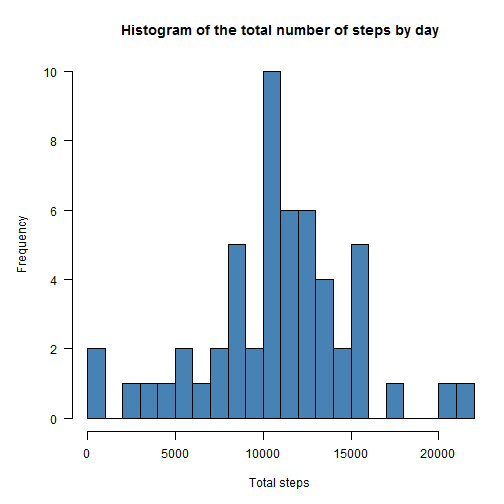
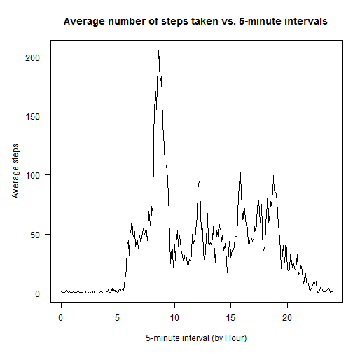
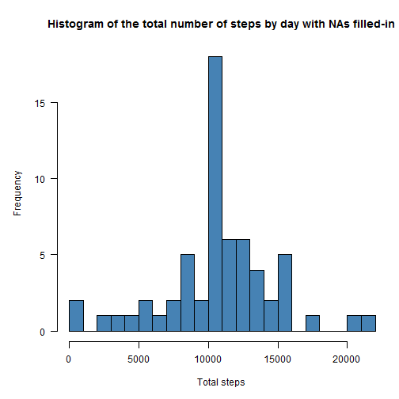

This is an R Markdown document for Peer Assessment 1 of Reproducible Research course. The assignment makes use of data from a personal activity monitoring device which collects data at 5 minute intervals through out the day. The data consists of two months of data from an anonymous individual collected during the months of October and November, 2012 and include the number of steps taken in 5 minute intervals each day.

You can download the data from the [website](https://d396qusza40orc.cloudfront.net/repdata%2Fdata%2Factivity.zip). 

The variables included in this dataset are:  
- **steps**: Number of steps taking in a 5-minute interval (missing values are coded as NA)  
- **date**: The date on which the measurement was taken in YYYY-MM-DD format  
- **interval**: Identifier for the 5-minute interval in which measurement was taken  

The dataset is stored in a comma-separated-value (CSV) file and there are a total of 17,568 observations in this dataset.

This report will answer the several questions detailed below. Moreover, you are welcome to access the [RepRes.R](https://github.com/MenghaoLiu/RepData_PeerAssessment1/blob/master/RepRes.R) script for this assignment.

## Loading and preprocessing the data

First, let's read the dataset into R.


```r
# Create a new folder named RepRes under your default working directory and set 
# your workspace into this folder

if (!file.exists("RepRes")) {
    dir.create("RepRes")
}
setwd("RepRes")

# Check whether the required raw dataset has been downloaded. If not, download 
# the .zip file

if (!file.exists("data.zip")) {
    url <- "http://d396qusza40orc.cloudfront.net/repdata%2Fdata%2Factivity.zip"
    download.file(url, destfile = "data.zip", mode = "wb")
}

# Unzip the dataset and read the activity.csv file to create myDT dataframe

unzip("data.zip")
myDT <- read.csv("activity.csv", stringsAsFactors = F)
```

Here, I processed the dataframe by transform the format of variable date to class "POSIXct" with package lubridate. Further processing of the data will be discussed in the later paragraphs.


```r
if(!is.element("lubridate", installed.packages()[,1])) {
    print("Installing packages")
    install.packages("lubridate")
}
library(lubridate)
myDT$date <- ymd(myDT$date)
```

## What is mean total number of steps taken per day?

In this part, I collapsed the data using *aggregate()* FUN and got a dataframe showing the total number of steps taken per day.


```r
aggDT1 <- with(myDT, aggregate(steps ~ date, FUN = sum, na.rm = T))
```

Here is a histogram of the total number of steps taken each day generated with *hist()* FUN in base plotting system.


```r
opar <- par(no.readonly = T)
par(mar = c(5, 5, 4, 1), cex = .85, las = 1)
with(aggDT1, hist(steps, breaks = 20, col = "steelblue", 
                  xlab = "Total steps", 
                  main = "Histogram of the total number of steps by day")
)
```

 

I also bulit the function *stat()* which calculated mean and median of a numeric vector and returns a dataframe.


```r
stat <- function(x){
    mean <- mean(x, na.rm = T)
    median <- median(x, na.rm = T)
    DT <- cbind(mean, median)
    return(DT)
}
```

With the function mentioned above, we can get the mean and median of the total number of steps taken per day.


```r
stat(aggDT1$steps)
```

```
##          mean median
## [1,] 10766.19  10765
```

## What is the average daily activity pattern?

We can add a new variable to **myDT** dataframe which formats the interval variable with decimal hours.


```r
int_char <- formatC(myDT$interval, width = 4, flag = "0")
myDT$int_scale <- as.numeric(substr(int_char, 1, 2)) + 
    as.numeric(substr(int_char, 3, 4)) / 60
```

Similarly, I collapsed the data and got a dataframe named **aggDT2** showing the average number of steps taken by 5-minute interval.


```r
aggDT2 <- with(myDT, aggregate(steps ~ interval + int_scale, FUN = mean, 
                               na.rm = T))
```

Here is a time series plot of the 5-minute interval and the average number of steps taken using base plotting system.


```r
par(mar = c(5, 5, 4, 1), cex = .85, las = 1)
with(aggDT2, plot(int_scale, steps, type = "l",
                  xlab = "5-minute interval (by Hour)", 
                  ylab = "Average steps", 
                  main = "Average number of steps taken vs. 5-minute intervals")
)
```

 

The 5-minute interval containing the maximum number of steps can be calculated as follows: 


```r
subset(aggDT2, aggDT2$steps == max(aggDT2$steps))[, c(1, 3)]
```

```
##     interval    steps
## 104      835 206.1698
```

## Imputing missing values

Let's first calculate the total number of missing values in the dataset.


```r
sum(!complete.cases(myDT))
```

```
## [1] 2304
```

I filled in all of the missing values with the corresponding average steps of 5-minute interval to generate a new complete dataframe **impDT** by the following chunk.


```r
int_unique <- unique(myDT$interval)
impDT <- myDT
for (i in 1:288) {
    impDT[which(impDT$interval == int_unique[i] & 
                    !complete.cases(impDT)), 1] <- aggDT2$steps[i]
}
```

We can check whether the new dataset have incomplete observations or not.


```r
sum(!complete.cases(impDT))
```

```
## [1] 0
```

So again, I collapsed the new dataset **impDT** with *aggregate()* FUN and got a dataframe named **aggDT3** showing the total number of steps taken per day.


```r
aggDT3 <- with(impDT, aggregate(steps ~ date, FUN = sum))
```

Here is a histogram of the total number of steps taken each day generated from NAs filled-in data


```r
par(mar = c(5, 5, 4, 1), cex = .85, las = 1)
with(aggDT3, hist(
    steps, breaks = 20, col = "steelblue", 
    xlab = "Total steps",
    main = "Histogram of the total number of steps by day with NAs filled-in")
)
```

 

```r
par(opar) # restore the original plotting parameter
```

Let's calculate the mean and median of the total number of steps taken per day with the new data. Compared with the results of the original data, the new dataset has the same mean value but a little bit different median value.


```r
stat(aggDT3$steps)
```

```
##          mean   median
## [1,] 10766.19 10766.19
```

```r
stat(aggDT1$steps) # mean and median of the original data
```

```
##          mean median
## [1,] 10766.19  10765
```

## Are there differences in activity patterns between weekdays and weekends?

I created a new factor variable **weekcat** in **impDT** with two levels -- "weekday" and "weekend" indicating whether a given date is a weekday or weekend day.


```r
impDT <- within(impDT, {
    weekcat <- NA
    weekcat[wday(date)>= 2 & wday(date) <= 6] <- "weekday"
    weekcat[wday(date) == 1 | wday(date) == 7] <- "weekend"
})
impDT$weekcat <- factor(impDT$weekcat, levels = c("weekend", "weekday"))
```

We can collapse **impDT** and get **aggDT4** dataset showing the average number of steps taken by 5-minute interval and weekcat.


```r
aggDT4 <- with(impDT, aggregate(steps ~ int_scale + weekcat, FUN = mean))
```

This is the final panel plot containing a time series plot of the 5-minute interval and the average number of steps taken across all weekday days or weekend days, made by lattice plotting system.


```r
if(!is.element("lattice", installed.packages()[,1])) {
    print("Installing packages")
    install.packages("lattice")
}
library(lattice)
xyplot(steps ~ int_scale | weekcat, data = aggDT4, type = "l", 
       col = "steelblue", layout = c(1, 2), xlim = c(0, 24), 
       xlab = "5-minute interval (by Hour)", 
       ylab = "Average steps", 
       main = "Average number of steps taken vs. 5-minute
       intervals across weekdays or weekends")
```

 


